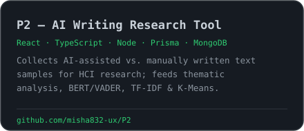

<!-- ─────────────────────────────────────────────────────────────
     profile readme · github.com/misha832-ux
     every panel is a hand-built svg in /assets (light + dark) with
     a transparent ground, so each panel sits flush on github's own
     background in either theme and nothing renders broken.
────────────────────────────────────────────────────────────── -->

<picture>
  <source media="(prefers-color-scheme: dark)" srcset="assets/header-dark.svg">
  <source media="(prefers-color-scheme: light)" srcset="assets/header-light.svg">
  
</picture>

  
  

<picture>
  <source media="(prefers-color-scheme: dark)" srcset="assets/whoami-dark.svg">
  <source media="(prefers-color-scheme: light)" srcset="assets/whoami-light.svg">
  
</picture>

<picture>
  <source media="(prefers-color-scheme: dark)" srcset="assets/ecosystem-dark.svg">
  <source media="(prefers-color-scheme: light)" srcset="assets/ecosystem-light.svg">
  
</picture>

<picture>
  <source media="(prefers-color-scheme: dark)" srcset="assets/projects-dark.svg">
  <source media="(prefers-color-scheme: light)" srcset="assets/projects-light.svg">
  
</picture>

<!-- each card links to its repo -->

  <a href="https://github.com/misha832-ux/P2"><picture><source media="(prefers-color-scheme: dark)" srcset="assets/proj-p2-dark.svg"><source media="(prefers-color-scheme: light)" srcset="assets/proj-p2-light.svg"></picture></a>
  <a href="https://github.com/Sakif16/nobojatra"><picture><source media="(prefers-color-scheme: dark)" srcset="assets/proj-nobojatra-dark.svg"><source media="(prefers-color-scheme: light)" srcset="assets/proj-nobojatra-light.svg"></picture></a>

  also on github: <a href="https://github.com/misha832-ux/study-buddy">study-buddy</a> ·
  <a href="https://github.com/misha832-ux/Customer-Category-Classifier">Customer-Category-Classifier</a> ·
  <a href="https://github.com/misha832-ux/Glowtrust_skincare_project">Glowtrust Skincare</a> ·
  <a href="https://github.com/misha832-ux/MyGallery">MyGallery</a>

<picture>
  <source media="(prefers-color-scheme: dark)" srcset="assets/telemetry-dark.svg">
  <source media="(prefers-color-scheme: light)" srcset="assets/telemetry-light.svg">
  
</picture>

<picture>
  <source media="(prefers-color-scheme: dark)" srcset="assets/route-dark.svg">
  <source media="(prefers-color-scheme: light)" srcset="assets/route-light.svg">
  
</picture>

<picture>
  <source media="(prefers-color-scheme: dark)" srcset="assets/stack-dark.svg">
  <source media="(prefers-color-scheme: light)" srcset="assets/stack-light.svg">
  
</picture>

<picture>
  <source media="(prefers-color-scheme: dark)" srcset="assets/footer-dark.svg">
  <source media="(prefers-color-scheme: light)" srcset="assets/footer-light.svg">
  
</picture>

